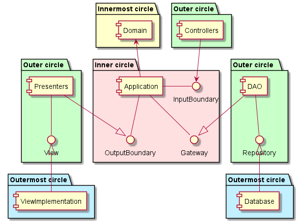
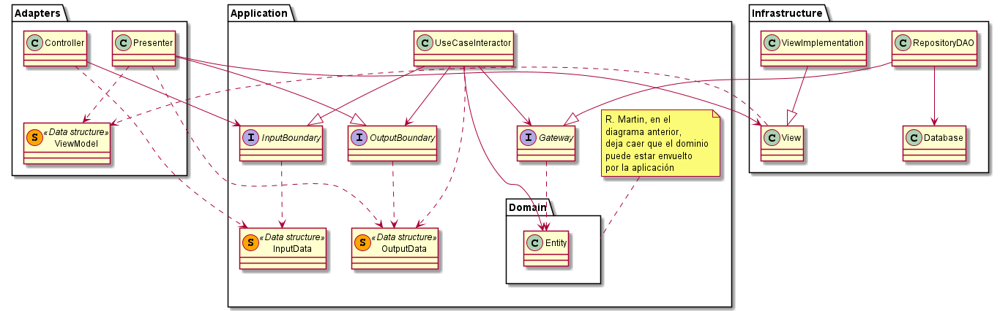
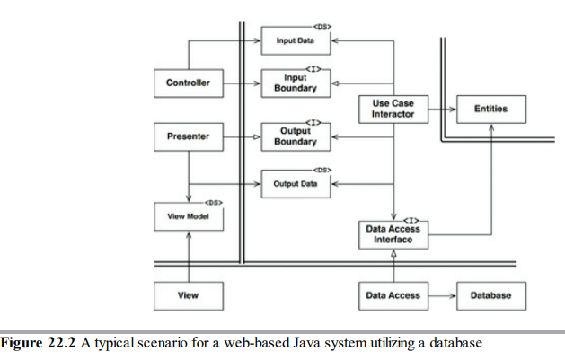
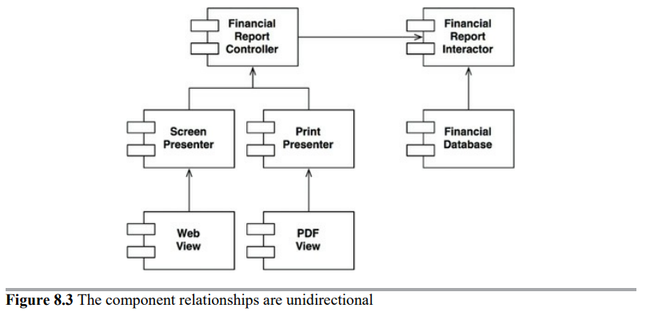
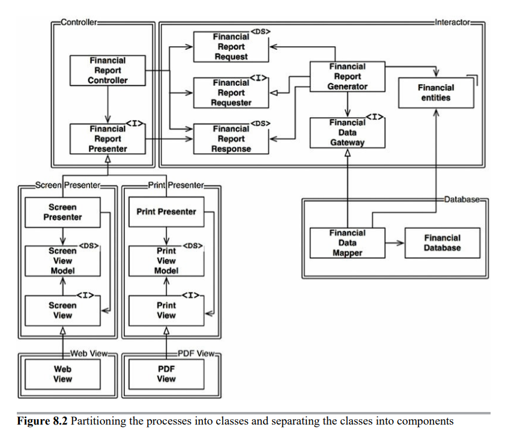
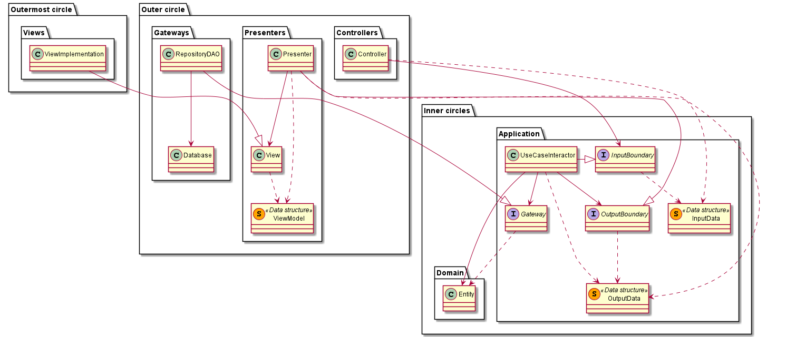

# Clean Architecture

Se va a implementar una arquitectura por capas siguiendo la terminología de la *clean architecture* propuesta por Robert Martin.

## Diagrama resumen
TL;DR: este documento explica cómo la Clean Architecture originalmente propuesta
puede resumirse en este simple diagrama de componentes.

Los paquetes coloreados referencian a la presentación circular tan conocida de esta arquitectura,
similar a las que proponen otras como la arquitectura hexagonal (puertos y adaptadores) o la arquitectura de cebolla.

## Correspondencia con MV*
Esta tabla asocia dicha terminología con patrones arquitectónicos MV*:

| Clean   |      MV*      |  Observaciones |
|:-------:|:-------------:|:--------------:|
| Controller |  Vista de entrada | Como hemos visto que era originalmente en SmallTalk |
| Interactor |    Controlador   |   Se definen a partir de los casos de uso |
| Entity | Modelo |    Como en Entity-Control-Boundary de Ivar Jacobson |
| Presenter | ¿Presentador? |    Puente entre controlador (Interactor) y vistas |
| View | Vista tonta |    Solo recibe modelos de datos que usa para cambiar el estado de la vista |
    
Los principios en los que se basa son los que pueden resumir a cualquier arquitectura multitier:
- El flujo de dependencias es unidireccional.
    - La dirección va de menos abstracción (mayor dependencia con tecnologías) a más abstracción.
- El flujo de control hace un viaje de ida y vuelta, siguiendo primero el flujo de dependencias y después el sentido contrario.

### Estructuras de datos

Los elementos anteriores se comunican información apoyándose en estructuras de datos que son clases tontas,
sin responsabilidad, análogas a los DTO solo que simplemente atravesando capas de la arquitectura.

| Estructura   | Descripción |      Quién la envía      |  Quién la recibe | 
|:-------:|:-----:|:--------:|:--------------:|
| Input data | Qué entrada se ha recibido del usuario |  Controller | InputBoundary (UseCase/Interactor) |
| Output data | La respuesta que se manda de vuelta al usuario | UseCase/Interactor | OutputBoundary (Presenter) |
| ViewModel | Qué actualizar en la vista | Presenter | View (ViewImplementation) |

### Abstracciones

Se usan interfaces como "enchufes" que invierten las dependencias, de manera que las capas menos abstractas
implementan esas interfaces sin que las capas más abstractas tengan que conocerlas. 

| Abstracción   | Descripción | En qué capa está |  Quién la conoce      |  Quién la implementa | 
|:-------:|:-----:|:--------:|:--------------:| :-----:|
| InputBoundary | Entrada desde la infraestructura hacia el dominio | Dominio (Domain+Application*) |  Controller | UseCase/Interactor |
| OutputBoundary | Salida desde el dominio hacia la infraestructura | Dominio (Domain+Application*) | UseCase/Interactor | Presenter |
| Gateway | Conexiones con persistencia | Dominio (Domain + Application*) | UseCase/Interactor | DAO |
| View | Descripción genérica de una vista | Presentation | Presenter | ViewImplementation |

*Ver apartado [Capas mínimas](#capas-mínimas) para no confundir ese concepto de «Dominio» con la capa *Domain*.

## Capas recomendadas

Las capas que propone por defecto la Clean Architecture son:

| Capa   |      Contiene      |  Conoce a | 
|:-------:|:-------------:|:--------------:|
| Domain |  Entities | Ninguna otra capa, ya que es la de mayor abstracción |
| Application |    Interactors/UseCases y Boundaries de entrada/salida   |   Domain |
| Adapters | Controllers, Presenters, implementación de Gateways... |    Application y tal vez Domain |
| Frameworks | Databases, UI... |    Adapters |

Un ejemplo de aplicación de lo anterior podría ser el siguiente diagrama:  

Que viene del ejemplo original mencionado por Robert Martin.

Las capas son maleables y pueden añadirse, trocearse o combinarse de la forma que mejor convenga al proyecto.

## Capas mínimas
Sin embargo, como mínimo debe existir la noción de estas dos grandes capas:

| Capa   |      Contiene      |  Conoce a | 
|:-------:|:-------------:|:--------------:|
| Domain |  Domain* + Application | Ninguna otra capa, ya que es la de mayor abstracción |
| Infrastructure |  Adapters + Frameworks  |   Domain |

*El nombre de Domain en este caso se extiende y es quizá desafortunado por su ambigüedad,
pero al final se trata de diferenciar, simplemente, entre abstracciones y detalles de implementación.

## Capas cohesivas
Estas organizaciones en capas, sin embargo, violan en mayor o menor medida uno de los seis principios de arquitectura que hemos visto, propuestos también por Robert Martin.  
Se trata del *Reuse/Release Equivalence Principle*, que dice que los componentes (paquetes) deben poder desplegarse de forma independiente sin afectar al resto.  
Es decir, que los componentes de un sistema sean cohesivos.

Para ello habría que trocear las capas más exteriores, ya que por ejemplo la de adaptadores incluye tanto controladores como presentadores, que no tienen cohesión entre sí.  
Este troceo se ejemplifica comparando las tres siguientes imágenes, donde:
- la primera define la arquitectura propuesta en general, que ya se ha visto al principio;

- la segunda muestra el flujo de dependencias según abstracción;

- la tercera la trocea para aumentar la cohesión de componentes;

Así pues, estos dos diagramas ejemplifican esa cohesión:
- entre los componentes:

- con las relaciones entre clases:

  
Por último, sintetizando entre el diagrama de capas que se vio anteriormente
y esta última estructura de capas circulares, que es la que ha trascendido como
la representante de la Clean Architecture,
se podría tener todo completo en este diagrama final:

