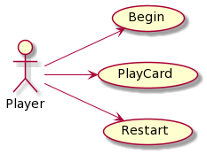
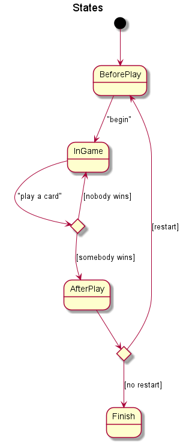
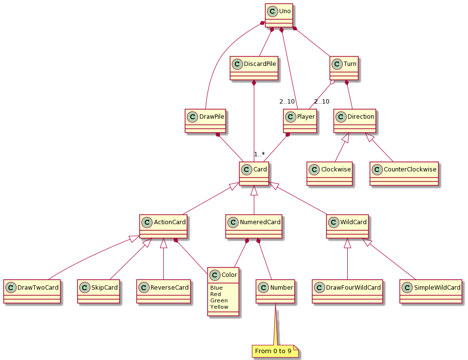
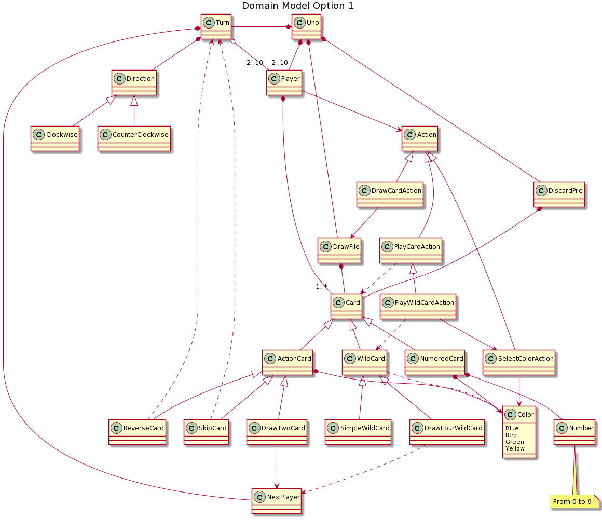
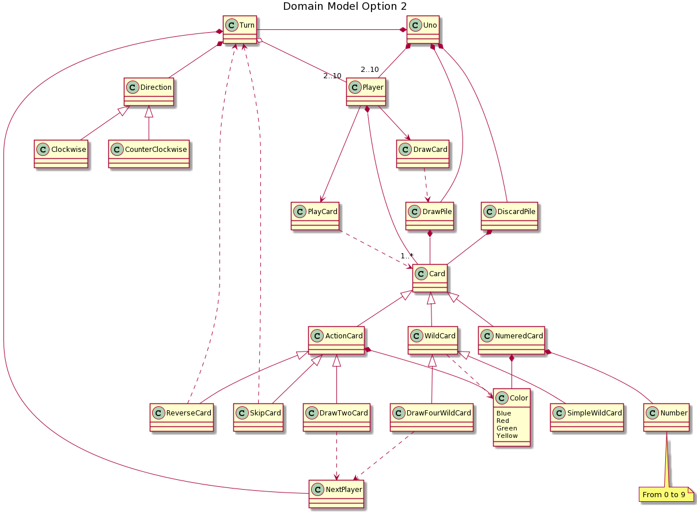
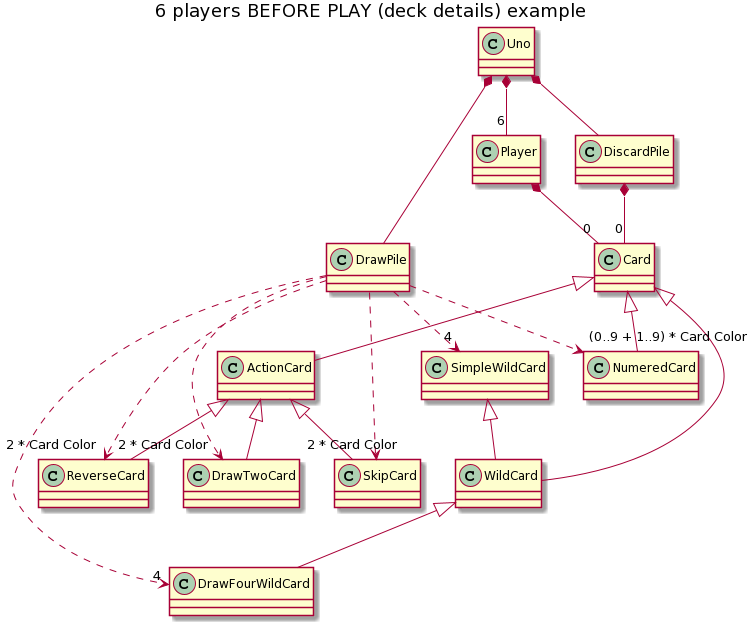
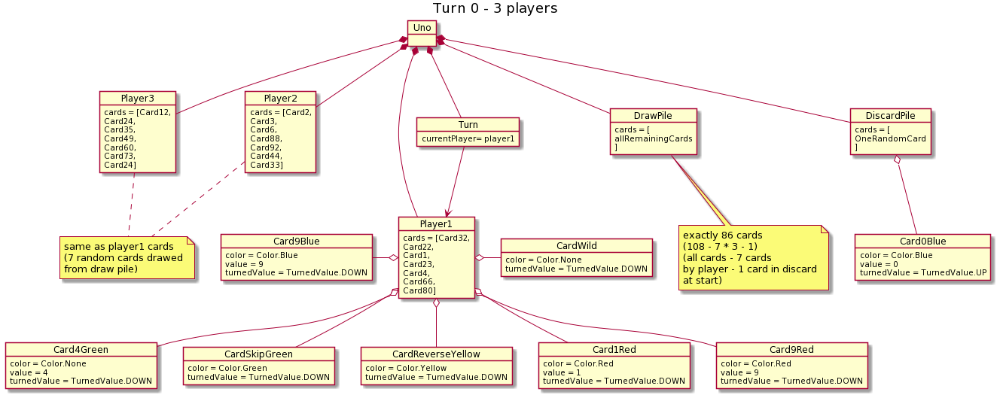

# Uno

**Índice**

1. [Reglas](#reglas)  
2. [Diagrama de Actores y Casos de Uso](#diagrama-de-actores-y-casos-de-uso)  
3. [Modelo del dominio](#modelo-del-dominio)  
    3.1 [Simple](#simple)  
    3.2 [opcion 1](#opcion-1)  
    3.3 [opcion 2](#opcion-2)  
4. [Interfaz](#interfaz)  
    4.1 [Componentes](#componentes)  
    4.2 [Ejemplo](#ejemplo)  

# Reglas


### Como Jugar
https://youtu.be/DQzOvL87vss

### Manual de donde hemos sacado los nombres de las entidades.
https://www.unorules.com/

### Manual oficial en español
[](./Docs/Rules/UNO-reglas.pdf)
### Resumen del juego
https://www.unorules.org/

### Contenido de un Deck


### Diagrama de Actores y Casos de Uso

| Diagrama de Actores y Casos de Uso | Diagrama de Contexto |
|---|---|
|  | 


### Modelo del dominio

#### Simple


#### Opcion 1


#### Opcion 2


### Diagramas de objetos
#### Before Play Deck Details


#### Turn 0 - 3 players


# Interfaz

### Componentes
```
    UNO! Starting...
    How many players?
        -> 0
    Invalid answer! Player must be inbetween 2 and 10.
    How many players?
        -> 3
    3 players selected.
    How many human players?
        -> 4
    Invalid answer! Human players must be lower than total players.
    How many human players?
            -> 0
        Invalid answer! Human players must be at least 1.
    
    ===============
    
    Shuffling deck.
    Players hands dealt.

    Player 1:
            1.[Red, 3], - new!
            2.[Green, 4], - new!
            3.[Green, Reverse], - new!
            4.[Red, 0], - new!
            5.[Yellow, Skip], - new!
            6.[WildCard] - new!
            7.[WildCard] - new!
    ...
    
    ================
    
    Current player:
        Player 1:
            [7 cards]
    Direction:
        Forwards
    Discard pile: [Blue, 3] at top
        
    What card you want to play?
        Player 1:
                1.[Red, 3], - new!
                2.[Green, 4], - new!
                3.[Green, Reverse], - new!
                4.[Red, 0], - new!
                5.[Yellow, Skip], - new!
                6.[WildCard] - new!
                7.[WildCard] - new!
        -> 8
        Invalid answer! Card out of range.
    What card you want to play?
            Player 1:
                    1.[Red, 3], - new!
                    2.[Green, 4], - new!
                    3.[Green, Reverse], - new!
                    4.[Red, 0], - new!
                    5.[Yellow, Skip], - new!
                    6.[WildCard] - new!
                    7.[WildCard] - new!
            -> 1
    ================ 
    ...
    ...
    ...        
```

### Ejemplo

```
NumeredCardView:

    [Color, Number]
    
    Examples:
    [Red, 3]
    [Blue, 0]
    [Green, 9]
    [Yellow, 5]


ActionCardView:

    [Color, {Action}]
    
    Examples:
    [Red, DrawTwo]
    [Red, Skip]
    [Red, Reverse]


WildCardView:

    [{WildCardType}]
    
    Examples:
    [WildCard]
    [DrawFourWildCard]

PlayedWildCardView:

    [Color, WildCardType]
    
    Examples:
    [Green, WildCard]
    [Yellow, DrawFourWildCard] 


PlayerHandView:

    Player Number:
        1. CardView*,
        2. CardView - new!*
    
    Example:
    Player 1:
        1. [Red, 3],
        2. [WildCard] - new!
    Player 5:
        1. [Green, Reverse]


PlayerView:
    
    Player Number:
        [n cards]

    Examples:
    Player 1:
        [3 cards]
    Player 5:
        [1 card!]


TurnView:

    Current player:
        PlayerView
    Direction:
        [Forwards|Backwards]
    {DiscardPileView}
    
    Examples:
    Current player:
        Player 5:
            [3 cards]
    Direction:
        Forwards
    Discard pile: [Green, 0] at top
    Current player:
        Player 2:
            [1 card!]
    Direction:
        Backwards
    Discard pile: [Blue, Skip] at top
        

DrawPileView: (*no sabemos si hace falta)

    Draw pile: [n cards] remaining
    
    Example:
    Draw pile: [34 cards] remaining
    

DiscardPileView:

    Discard pile: {CardView} at top
    
    Example:
    Discard pile: [Green, 7] at top
    Discard pile: [Red, WildCard] at top


ColorsView:

    1. Blue
    2. Red 
    3. Green
    4. Yellow


SelectColorActionView: (*después de usar un comodín o comodín-roba-cuatro)

    What color to change to?
        {ColorsView}


PlayCardActionView: (* al principio de cada turno)

    What card you want to play?
        PlayerHandView

UnoStartView:

    UNO! Starting...
    How many players?
        [Read until correct answer, 2-10]
    How many human players?
        [Read until correct answer, 1 <= x <= players]
```
